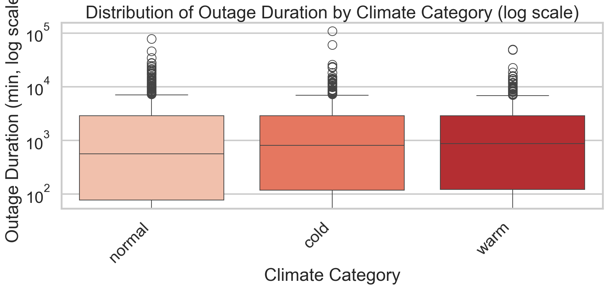

# Power Outage: Predicting How Long the Lights Stay Off

**Vivian Zhu**

---

## Introduction

Power outages affect millions of Americans every year, disrupting daily life, 
businesses, and critical infrastructure. But not all outages have the same impact,
some last minutes and only a few blocks feel it. Others can span on for days,
and impact thousands of people. What factors determines how long an outage will last?

This project analyzes a dataset containing data about major power outage data from January 2000 to July 2016.
This data is from Purdue University's research data. The data contains information about where the
power outage occurred, when it occurred, what was its duration, its impact, and geographical, climate,
economical data on the surrounding area. 

I will perform various data cleaning and analysis on the data to gain an understanding of the data.
Then I will analyze the cause of missingness of data in a column. Then, I will explore the research question, do
power outages occurr at the same frequencies during the daytime and night time. Finally we will create a baseline model
and a final model for the central question:

> **Can we predict the duration of a power outage based on information 
> available at the time it begins?**

The dataset contains **1,534 rows** and **56 columns**, each representing a single major power 
outage event. For our project we will focus on thh following columns:

| Column | Description |
|--------|-------------|
| `YEAR` | Year the outage occurred |
| `MONTH` | Month the outage occurred |
| `U.S._STATE` | State where the outage occurred |
| `POSTAL.CODE` | Postal code where the outage occurred |
| `NERC.REGION` | North American Electric Reliability Corporation region involved in the outage event |
| `CLIMATE.REGION` | U.S. climate region specified by National Centers for Environmental Information |
| `CLIMATE.CATEGORY` | Climate categories (Warm, Cold ,Normal)based on a threshold of ± 0.5 °C for the Oceanic Niño Index (ONI) |
| `ANOMALY.LEVEL` | Oceanic El Niño/La Niña index indicating climate anomaly severity |
| `OUTAGE.START.DATE` | Date the outage began |
| `OUTAGE.START.TIME` | Time of day the outage began |
| `OUTAGE.RESTORATION.DATE` | Date power was fully restored |
| `OUTAGE.RESTORATION.TIME` | Time power was fully restored |
| `CAUSE.CATEGORY` | General cause of the outage |
| `HURRICANE.NAMES` | Name of the hurricane if the outage was due to hurricane |
| `OUTAGE.DURATION` | Duration of the outage in minutes |
| `CUSTOMERS.AFFECTED` | Number of customers affected by the outage |
| `TOTAL.PRICE` | Average monthly electricity price in the state (cents/kWh) |

## Data Cleaning and Exploratory Data Analysis

### Data Cleaning

We performed the following cleaning steps on the raw dataset:

1. **Combined date and time columns** — `OUTAGE.START.DATE` and `OUTAGE.START.TIME` 
were merged into a single `OUTAGE.START` timestamp column, and similarly for 
`OUTAGE.RESTORATION.DATE` and `OUTAGE.RESTORATION.TIME` into `OUTAGE.RESTORATION`. This makes it easier 
to compute durations and extract time features.

2. **Dropped rows with missing timestamps or duration** — Rows where 
`OUTAGE.START`, `OUTAGE.RESTORATION`, or `OUTAGE.DURATION` were null were 
removed. These represent outages where the start or end time was never recorded, 
making them impossible to use for duration prediction.

3. **Created `IS.HURRICANE` column** — Instead of keeping the raw 
`HURRICANE.NAMES` column (which was mostly null), we created a binary column 
indicating whether the outage was hurricane-related, then dropped the original column.

4. **Imputed missing `TOTAL.PRICE` values** — All null values in `TOTAL.PRICE` 
corresponded to July 2016. Since no July 2016 prices existed, we imputed using 
random sampling from July 2014 and July 2015 values, preserving the seasonal 
distribution of electricity prices from recent years.

5. **Filled missing `CLIMATE.REGION` with 'Hawaii'** — All null values in 
`CLIMATE.REGION` belonged to Hawaii, which is not part of the standard U.S. 
climate regions. We assigned these rows their own `'Hawaii'` region rather than 
dropping them.

6. **Extracted time features** — Added `START.HOURS` (hour of day, 0-23) and 
`DAY.OF.WEEK` (0=Monday, 6=Sunday) from the `OUTAGE.START` timestamp for use 
as model features.

After cleaning, the dataset contains **1,476 rows** and **19 columns**. Here are the first few rows:

<iframe src="plots/cleaned_outage_head.html" width="100%" height="350" frameborder="0"></iframe>
---

### Univariate Analysis
The following histogram shows the distribution of power outage durations in minutes. I thought it would be
interesting to see if the data is normally distributed or skewed. 

<iframe src="plots/outage_histogram.html" width="800" height="500" frameborder="0"></iframe>

The distribution of outage durations is heavily right-skewed, with most outages 
lasting under 10,000 minutes but a long tail of extreme events 
stretching beyond 100,000 minutes. This skew motivated our use of a log 
transformation on the target variable during modeling.

This next graph shows the average duration of power outages for each cause category.

<iframe src="plots/outage_average_by_cause.html" width="800" height="500" frameborder="0"></iframe>

Fuel supply emergencies cause the longest average outages by 
far, while intentional attacks and islanding tend to resolve much faster. 
This suggests that cause category will be an important predictor of outage duration.

This graph displays the average outage duration for each state in minutes. 

<iframe src="plots/avg_duration_by_state.html" width="800" height="500" frameborder="0"></iframe>

Average outage duration varies substantially by state, with states in the eastern part generally having longer
power outage durations. This geographic pattern suggests that climate region will play a role in outage duration.

---

### Bivariate Analysis

The boxplot below shows outage duration by climate category on a log scale:

All three boxplots have a similar shape. With the cold and warm boxplots having slightly higher median
than the normal climate boxplot. This might indicate that more extreme weather have an impact on the
duration of power outages.

---

### Interesting Aggregates

We grouped outages by `CLIMATE.REGION` and applied aggregation to examine regional patterns in outage 
severity and scale:

<iframe src="plots/agg_by_cause.html" width="100%" height="350" frameborder="0"></iframe>

The East North Central and Northeast regions stand out with the highest average 
outage durations and max duration. From this we can see that the climate region affects
the distribution and pattern of outage duration.

## Assessment of Missingness

### MNAR Analysis

We believe the `CUSTOMERS.AFFECTED` column is **MNAR** (Missing Not At Random). 
Around 30% of values are missing, and we suspect the missingness is related to 
the value itself — smaller, less severe outages may not have had customer impact 
formally recorded, meaning outages with fewer affected customers are more likely 
to be missing. To confirm this and make it MAR, we would need additional data 
such as utility company reporting standards or outage severity classifications, 
which would explain why certain outages went unreported.

### Missingness Dependency

We analyzed whether the missingness of `CUSTOMERS.AFFECTED` depends on other columns.

**Depends on: `OUTAGE.DURATION`**

- **Null:** Missingness of `CUSTOMERS.AFFECTED` does not depend on `OUTAGE.DURATION`
- **Alternative:** Missingness of `CUSTOMERS.AFFECTED` depends on `OUTAGE.DURATION`
**Test Statistic:** Difference in mean `OUTAGE.DURATION` between missing and 
non-missing groups
- **Result:** p-value = 0.0282 < 0.05 → reject null. The missingness of 
`CUSTOMERS.AFFECTED` is dependent on `OUTAGE.DURATION`, suggesting it is **MAR** 
with respect to outage duration. Longer outages are more likely to have customer 
impact recorded.

<iframe src="plots/missingness_permutation.html" width="800" height="500" frameborder="0"></iframe>

The distribution of outage duration differs noticeably between rows where 
`CUSTOMERS.AFFECTED` is missing vs. not missing, confirming the dependency. 
Outages with missing customer data tend to be shorter on average.

**Does not depend on: `TOTAL.PRICE`**

- **Null:** Missingness of `CUSTOMERS.AFFECTED` does not depend on `TOTAL.PRICE`
- **Alternative:** Missingness of `CUSTOMERS.AFFECTED` depends on `TOTAL.PRICE`
**Test Statistic:** Difference in mean `TOTAL.PRICE` between missing and 
non-missing groups
- **Result:** p-value 0.8248 > 0.05 → fail to reject null. No significant dependency 
found between missingness and electricity price. There is insufficient 
evidence to conclude that the missingness of `CUSTOMERS.AFFECTED` depends on 
electricity price. The observed difference is consistent with random chance.

## Hypothesis Testing

We investigated whether power outages are equally likely to start at any time 
of day, or whether outages disproportionately occur during certain periods.

**Groups:**
- **Day:** outages starting between 6am and 6pm
- **Night:** outages starting between 6pm and 6am

**Null Hypothesis:** Power outages start times are uniformly distributed and
outages are equally likely to begin during the day or night.

**Alternative Hypothesis:** Power outages are not uniformly distributed across 
the day and outages occur at different frequencies during day vs. night.

**Test Statistic:** Difference between the maximum and minimum proportion of 
outages across the two time periods (day vs. night). This is a good choice 
because under the null hypothesis of uniformity, both groups should have equal 
proportions (~0.5), making the difference close to 0. A large observed difference 
suggests the distribution is not uniform.

**Significance Level:** 0.05

**Result:** p-value ≈ 0.0000

**Conclusion:** Since our p-value is far below our significance level of 0.05, 
we reject the null hypothesis. The data suggests that power outages do not start 
uniformly throughout the day.
<iframe src="plots/hypothesis_test.html" width="800" height="500" frameborder="0"></iframe>

## Framing a Prediction Problem

**Prediction Problem:** Can we predict the duration of a power outage using 
information available at the time the outage begins?

**Type:** Regression: we are predicting `OUTAGE.DURATION`, a continuous 
numerical variable measured in minutes.

**Response Variable:** `OUTAGE.DURATION` — we chose this variable because 
outage duration is the most direct measure of how severely an outage impacts 
affected communities. Being able to predict how long an outage will help those affect
know what they should do and plan during the outage. 

**Features Used at Time of Prediction:**
We only use features that would be known at the moment an outage begins:
- `CLIMATE.REGION` — known from the outage location
- `CAUSE.CATEGORY` — known at the time the outage is reported
- `CLIMATE.CATEGORY` — known from weather monitoring at time of outage
- `ANOMALY.LEVEL` — known from climate data at time of outage
- `START.HOURS` — known from the outage start timestamp
- `DAY.OF.WEEK` - know when the outage start

We explicitly excluded features like `CUSTOMERS.AFFECTED` and 
`OUTAGE.RESTORATION` since these are only known **after** the outage has already 
occurred.

**Evaluation Metric:** We use **Median Absolute Error (MAE)** as our primary 
evaluation metric rather than RMSE. Our target variable `OUTAGE.DURATION` is 
heavily right skewed. The median outage is ~700 minutes but the max is over 
100,000 minutes. RMSE heavily penalizes large errors, meaning a handful of 
extreme outliers would dominate the metric and give a misleading picture of 
typical model performance. MAE is robust to these outliers and better reflects 
how well the model predicts a **typical** outage duration.
